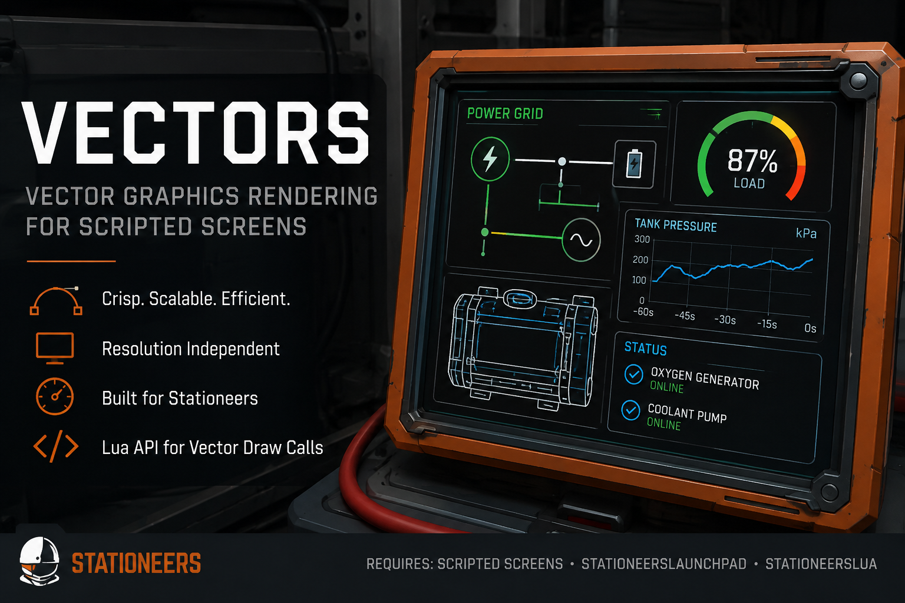

# ScriptedScreens Vector



A client-side Stationeers mod that adds a **`vector` element type** to
[ScriptedScreens](https://steamcommunity.com/sharedfiles/filedetails/?id=3666779631) surfaces.

Instead of drawing pixel by pixel onto a canvas, you describe a picture once as structured
data and the client draws it as real geometry — then animates it from expressions, every
frame, without Lua or network traffic doing anything at all.

```lua
{ op = "R", x = 10, y = "=100-$fill*100", w = 40, h = "=$fill*100", f = "#2E8B6E" }
```

Send `fill` twice a second; the bar moves smoothly at display rate.

---

## Why

A canvas console costs roughly **10 FPS**, and the cause is the number of drawing operations
per frame — not fill area and not resolution. Every op is recorded, batched, sent over the
network, replayed, and uploaded as a texture, sixty times a second.

This makes that count **zero**. Tessellation also runs on a worker thread, so a console with
800 animated shapes at 30 Hz costs about **0.4% of a frame** on the main thread — a console
being switched on is not measurably different from it being off.

What that buys on top of the framerate:

- **Real alpha.** Straight source-over blending, so no pre-composited opaque palettes.
- **Any resolution.** Coordinates are a viewbox mapped onto the element.
- **Antialiased edges**, sized in screen pixels rather than scene units.
- **Curves, gradients, clipping, dashes, rounded corners** as single attributes.
- **No instruction-budget pressure.** A repeat of 2,000 motes is one node.

---

## Documentation

| | |
|---|---|
| [`ScriptedScreensVector/README.md`](ScriptedScreensVector/README.md) | the authoring guide — start here |
| [`ScriptedScreensVector/REFERENCE.md`](ScriptedScreensVector/REFERENCE.md) | every node, attribute and expression function |
| [`ScriptedScreensVector/examples/`](ScriptedScreensVector/examples) | eight progressive examples, each runnable on paste |
| [`vector-format-spec.md`](vector-format-spec.md) | the format specification and the reasoning behind it |

Paste [`examples/01-hello.lua`](ScriptedScreensVector/examples/01-hello.lua) into a chip
attached to a console. If you see a rounded panel with a green circle, everything works.

---

## Installing

Requires [ScriptedScreens](https://steamcommunity.com/sharedfiles/filedetails/?id=3666779631)
(load it **before** this mod), [StationeersLaunchPad](https://github.com/StationeersLaunchPad/StationeersLaunchPad)
and BepInEx 5.x.

Drop the built folder — `About/` plus the DLL — into your Stationeers `mods` directory.
Client-side only; nothing on disk is modified and the element type is added by a single
Harmony postfix.

---

## Building

1. Copy `Stationeers.VS.User.props.example` to `Stationeers.VS.User.props` and point
   `SteamLibraryDirectory` at the folder containing your Stationeers install.
2. `dotnet build ScriptedScreensVector/ScriptedScreensVector.csproj -c Release -p:Platform=x64`

The build copies the mod into your Stationeers `mods` folder.

> **If the build succeeds but nothing changes in game, check the deploy path first.** Every
> copy step is `ContinueOnError`, so a wrong `StationeersDocumentsDirectory` fails silently.
> If OneDrive has redirected your Documents folder, uncomment that override in
> `Stationeers.VS.User.props` and point it at the folder that actually holds `modconfig.xml`.

### Tests

```
cd ScriptedScreensVector.Tests && dotnet run
```

Exit code 0 on pass. The tests compile the real geometry sources — `Triangulator.cs`,
`Clip.cs`, `Gradient.cs`, `Expression.cs` — against a stub logger rather than re-implementing
them, because a ported copy drifts from the code it claims to test. Unity's `Vector2` and
`Mathf` are ordinary managed types and run fine outside the engine.

They are worth reading as documentation of what has actually gone wrong: every one was
verified by reverting its fix and watching it fail. A regression test that has never been
seen to fail is an assumption, not a test.

`dotnet run -c Release -- --bench` runs the microbenchmarks instead.

> Not everything in `UnityEngine` works headless. `Vector2` and `Mathf` do;
> `ColorUtility.TryParseHtmlString` and `Matrix4x4.lossyScale` are **native ECalls** and throw
> `SecurityException` outside the player. That makes the test project a useful detector for
> them — both have caused real bugs here.

---

## Status

Working and in use on real consoles. The format covers groups, repeats, rectangles, ellipses,
SVG paths with holes, polylines, polygons, sampled bands and lines, Catmull-Rom splines,
linear and radial gradients, convex clipping, strokes with caps/joins/dashes, geometric
feathering, and a full expression grammar with deterministic hashing.

Not supported, deliberately: text (use ScriptedScreens' own labels over the artwork), blur and
drop shadow (both need an offscreen pass), non-convex clipping (needs a stencil buffer), and
self-intersecting fills.

---

## Licence

[MIT](LICENSE). ScriptedScreens itself is a separate, third-party mod and is not covered by
it — this repository contains no code from it.
